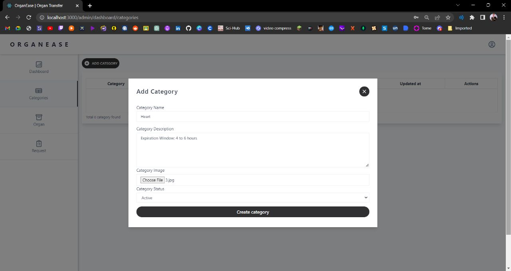
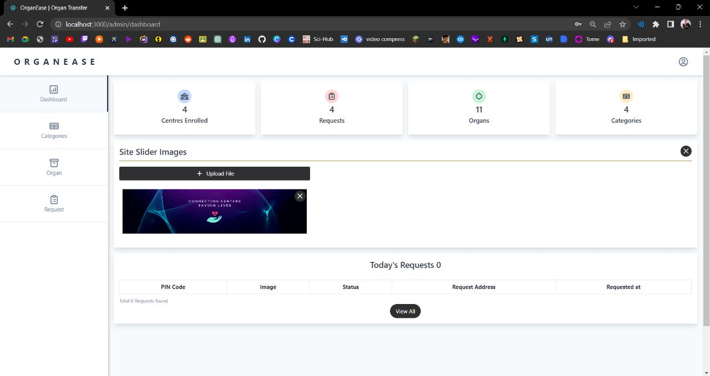
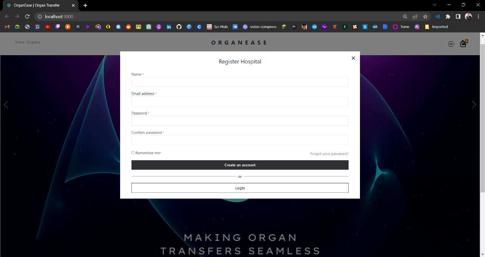
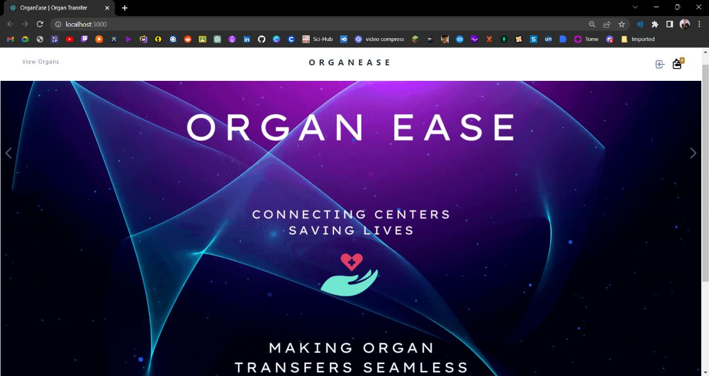
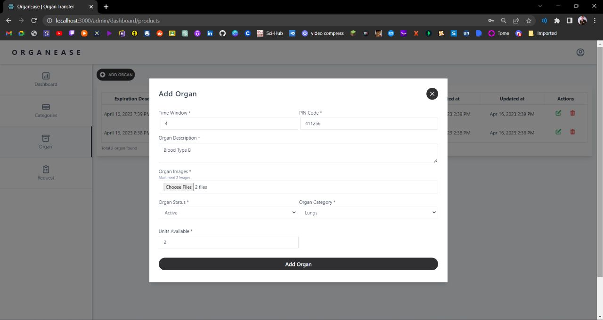
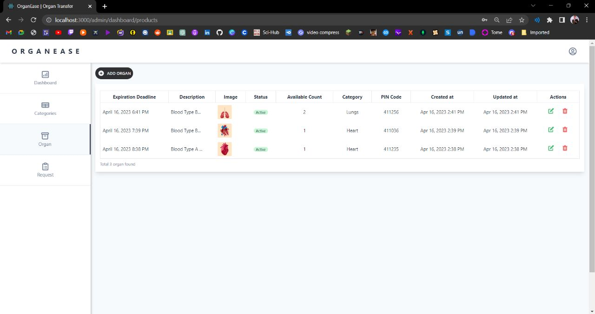

# 🩺 Organ Donation Application (MERN Stack)

A modern and user-friendly web application built with the **MERN stack** (MongoDB, Express, React, Node.js) to promote and manage **organ donation** in a transparent, efficient, and secure manner.

## 📝 About the Website

This Organ Donation platform serves as a digital bridge between **organ donors**, **recipients**, and **healthcare institutions**. It aims to streamline the process of **registering as an organ donor**, **searching for organ availability**, and enabling **hospitals to manage and verify donations**.

Organ donation is a life-saving act, yet many people remain unaware or hesitant due to the lack of a proper system. This platform solves that by providing:

- A centralized space for **donors** to register and manage their profiles.
- A tool for **recipients** to find matching organ donors quickly based on criteria like blood group, organ type, and location.
- A secure dashboard for **hospitals/admins** to verify requests and manage the donation process.

By using technology, we aim to:
- Raise awareness about organ donation,
- Increase donor participation,
- Reduce delays in matching organs with patients in need.

Together, let's make organ donation more accessible and life-saving for everyone. 💖

---
## 🚀 Tech Stack (MERN)

- **MongoDB** – NoSQL database for storing user and donation data
- **Express.js** – Backend framework for routing and APIs
- **React.js** – Frontend UI library for a responsive user interface
- **Node.js** – Runtime environment for server-side logic

---

## 📌 Key Features

### ✅ Donor Management
- Register as a donor with details like blood group, organ type, and contact info
- View and update donor profile
- Toggle availability status for donation

### Screenshots

  

  

  

  

  

  

As organs are needed ASAP for operations, time is the most crucial aspect. However, the existing method to request organs from procurement centre/ transplant centres is completely manual (manual data entry, manual communication via faxes, mails, phone calls) and thus is obviously error prone and time consuming. Therefore to solve this grave issue, 'OrganEase' is proposed. 

The website makes the tedious manual task of categorizing different organs and making entries for each, mere clicks away. In a particular region, say n number of procurement centres and/or transplant centres exist. All of them can display the organs stored in their hypothermic storages along with their details at one time (this completely solvesthe time-consuming problem of individually calling of procurement centres one by one which is done presently). 

Hospitals can request organs of suitable compatibility (Blood Group, etc) via the portal itself and make a payment which serves as a token of confirmation for the transfer procedure. Thereafter, the procurement centre has the option to confirm the request from their side.
